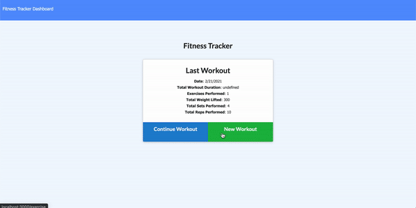

# workout-tracker
  
  

  ## Description
  This app allows users to save and track their workouts.
  
  ## Table of Contents
  1. [Installation](#Installation)
  2. [Usage](#Usage)
  3. [Demo](#Demo)
  3. [License](#License)
  4. [Contact Information](#Questions)

  ## Installation
  * Fork or clone the repo onto your machine to run locally. 
  * Run npm i. 
  * Run node server.js.

  ## Usage
  Use the project to add and track your workouts.
  #### [Live Link](https://workout-trckr.herokuapp.com)

  ## Demo
  
  ## License
  This project is licensed under the MIT license.

  ## Questions
  **Github:** [jesusefraingonzalez](https://github.com/jesusefraingonzalez)
  
  Contact me at jesusgonzalez0797@gmail.com with any additional questions. 
  
